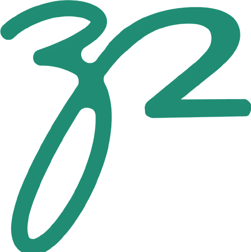

<div align="center">
    
    
    <h1>Z Squared</h1>
    <p>Welcome to the official documentation for the Z Squared website, a modern full-stack blog website using Next.js and React, with Notion serving as the backend CMS/database.</p>
</div>

## 👨🏾‍💻 Tech Stack
- **Language**: TypeScript
- **Framework**: Next.js
- **Frontend**: React
- **Design Framework**: Tailwind CSS
- **Design System**: ShadCN UI
- **CMS/Database**: Notion
- **Deployment**: Vercel

## 🤸🏾‍♂️ Usage

### 🚧 Prerequisites
Have `npm` or `yarn` installed on your machine.

### ⚙️  Running locally
**1. Clone the repository**
```bash
git clone https://github.com/ammar-ahmed22/zsquared.git
```

**2. Install dependencies**
```bash
yarn # npm install
```

**3. Start the development server**
```bash
yarn dev # npm run dev
```

## 📥 Issues
Feel free to raise an issue with any bugs, features or design changes!

All Rights Reserved (Ammar Ahmed, 2025)
